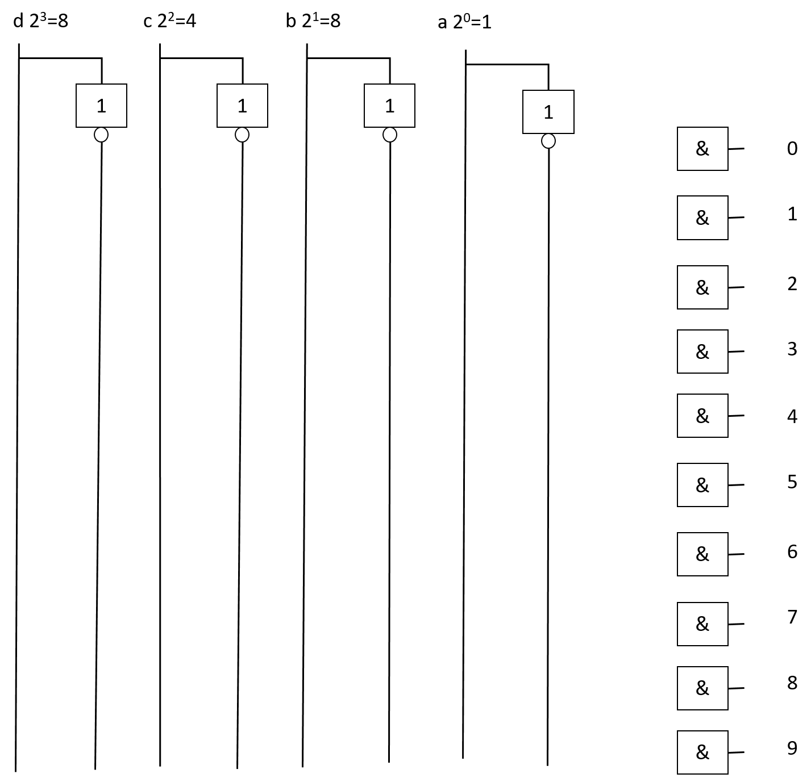
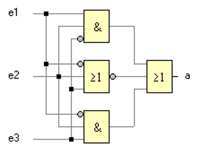

_Übungsaufgabe zur Veranstaltung [IT Systeme](https://hsro-wif-oop.github.io) im [Bachelorstudiengang Wirtschaftsinformatik](https://www.th-rosenheim.de/technik/informatik-mathematik/wirtschaftsinformatik-bachelor/) an der [Hochschule Rosenheim](http://www.th-rosenheim.de)._


# 02 - Logischer Entwurf von Computern

In dieser Übung verwenden wir uns mit Boolescher Algebra und Schaltnetzwerken beschäftigen.

**Die Lösung befindet sich im Branch Musterloesung.**


## Aufgabe 1: de Morgansche Gesetz und Verschmelzungsregel

Zeigen sie mit Hilfe einer Wahrheitstabelle, das die 

### 1.1 de Morganschen Gesetze

```
¬(a∧b) =¬a∨¬b 
¬(a∨b) =¬a∧¬b
```

und die

### 1.2 Verschmelzungsregeln

```
a∨¬a∧b = a∨b 
a∧(¬a∨b) = a∧b 
```

gelten.

## Aufgabe 2: 2-aus-3 Schaltung

In Kraftwerken gibt es viele Überwachungsanlagen, die bei GEfahr den Betrieb abbrechen, z.B. wird in einem Dampfkessel ständig die Temperatur überwacht. Das erfolgt mit drei Temperatursensoren. Meldet ein Sensor ein falsches Signal (er ist defekt!), dann wird der BEtrieb nicht sofort eingestellt. Erst wenn zwei von den drei Sensoren Alarm melden (Maximaltemperatur im Kessel ist überschritten), meldet die Überwachungsanlage des Kessels Alarm. Man nennt eine solche Schaltung 'Zwei aus drei Schaltung'.

Es gilt also: Der Ausgang y meldet dann eine 1, wenn mindestens zwei der Eingänge x1...x3 eine 1 führen.

### 2.1 Wahrheitstabelle

Stellen Sie die Wahrheitstabelle auf.

### 2.2 Logische Gleichung

Stellen Sie die logische Gleichung auf und vereinfachen diese w, wenn nötig.

### 2.3 Schaltnetzplan

Entwerfen Sie einen Schaltnetzplan.

## Aufgabe 3: Decoder/ Encoder

Mit 4 Eingangssignale (a,b,c,d) lassen sich die Werte 0..9 abbilden.

Ergänzen Sie den folgenden Logikplan, so dass die Werte 0..9 ausgegeben werden.





## Aufgabe 4: Schaltnetze

Gegeben ist folgende Schaltung:



- Stellen Sie die Wahrheitswertetabelle auf. 
- Geben Sie eine Logikgleichung an. Verwenden Sie die disjunktive Normalform.
- Zeichnen Sie das Schaltnetz neu, ersetzen Sie dabei die AND-Gatter durch OR- bzw. NOR-Gatter. - Verändern Sie die ursprüngliche Schaltung so, dass sie nur noch aus AND- bzw. NAND-Gattern besteht.

## Aufgabe 5: Halbaddierer in Java

Schreiben Sie eine Klasse *HalbAddierer*. Diese soll im Konstruktor 2 Parameter (a und b) übernehmen und direkt S (Wert) und C (Übertrag) berechnen. S und C sind Attribute der Klasse und können per Getter abgefragt werden.

Hierzu benötigt man kein grosses Projekt in IntelliJ, sondern eine einzelne Klasse sollte reichen. 

**Main-Methode nicht vergessen!**

In der main()-Methode können die einzelnen Fälle (wieviel gibt es?) abgedeckt werden.